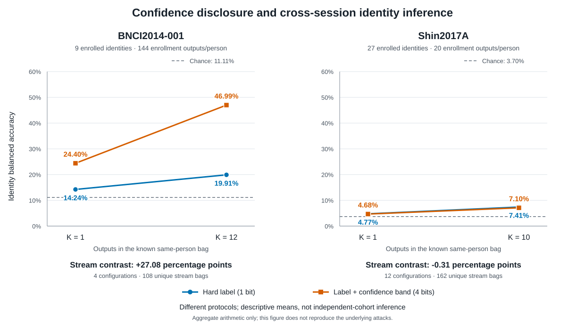

# Research log

This is a running development summary after the frozen v1.2 release. Update this
file in place; experiment contracts and reproducible evidence belong in their
own versioned artifacts when released. This log is not a new release, a complete
reproduction bundle, or an update to the published v1.0–v1.2 evidence.

## Current conclusion — 2026-09-10

No new subject-membership privacy defense is supported. Matched Cho2017
inclusion experiments show a positive average output-score change, but both
frozen stages missed their subject-direction gate. More model seeds did not
resolve that limitation. Later single-model membership tests also did not
establish reliable detection or a defense benefit. None of those negative
attacker outcomes proves privacy.

Two completed **passive output-stream identity** studies now show a conditional
result: confidence bands substantially increased the fixed attacker's achieved
identification on BNCI, but that advantage was not reproduced under the different
Shin portability protocol. Both used existing plain-model outputs, not a new
bottleneck defense. Both are closed without tuning or automatic extension.
Frozen releases and the original Shin bottleneck stop remain unchanged.

## Sep 10 — passive output-stream identity: benefit depends on the tested design

The observer sees only a task model's emitted symbols, has identity-labeled
enrollment outputs, and knows each target bag belongs to one of the enrolled
people. It does not see EEG/query inputs, true task labels, timestamps, routing
or device identifiers, weights or embeddings, and cannot issue adaptive queries.
Each identification attempt observes **one model**, not combined model outputs.
This is identity inference, not membership inference.

Compare binary hard decisions with sixteen symbols containing the same decision
and one of eight fixed winning-confidence bands. Source-session symbol counts
fit a fixed product-likelihood rule with uniform identity priors. Fine-category
pseudocount one induces hard-label pseudocount eight by exact marginalization;
exact likelihood ties select the lowest numeric identity. All enrollment tables
were committed before evaluation identity scoring. No bins, budgets, seeds,
smoothing values or classifiers were selected on these outcomes.



| Protocol | Enrolled people | Configurations | Outputs per bag | Hard-label identity BA | Confidence-band identity BA | Paired difference |
| --- | ---: | ---: | ---: | ---: | ---: | ---: |
| BNCI v19 | 9 | 4 | 1 | 14.24% | 24.40% | +10.17 pp |
| BNCI v19, primary | 9 | 4 | 12 | 19.91% | 46.99% | +27.08 pp |
| Shin v20 | 27 | 12 | 1 | 4.77% | 4.68% | -0.09 pp |
| Shin v20, primary | 27 | 12 | 10 | 7.41% | 7.10% | -0.31 pp |

BNCI's primary difference is positive at all four seeds. Shin has six positive
and six negative configuration differences, with rotation means exactly zero,
+0.46 pp and -1.39 pp. Shin's primary is 46 versus 48 successes across 648
model-bag evaluations: those reuse **162 distinct bags** across four seeds, not
648 independent bags. The bundle preserves exact integer successes, so the
first rotation is an exact tie rather than floating-point residue.

The BNCI protocol reuses nine people and 1,296 distinct held-out trials, with
144 enrollment outputs per person and 108 twelve-output bags repeated across
four models. Shin reuses 27 people and 1,620 distinct held-out trials across
three session rotations, with twenty enrollment outputs per person and 162
ten-output bags repeated across four seeds. BNCI bags stay within native runs;
Shin uses stored-order halves, not verified chronological adjacency. Original
model training/preprocessing, session roles and score precision also differ.
Relative pseudocount weight is 16/160 versus 16/36. **This is portability, not
exact replication or a controlled dataset effect.** No independent-cohort
interval or significance claim is made.

All task decisions are unchanged; task BA remains 72.99% for the BNCI models
and 63.41% for the Shin models. Suppressing confidence still removes information
needed for confidence-dependent utility such as abstention. These results do
not establish a deployment default or general privacy guarantee. Fine symbols
contain hard decisions, so lower achieved confidence-symbol accuracy cannot
mean less identifying information; it may reflect limits of this fixed attacker
and its enrollment/transfer setting. Hard-label streams themselves support
identification in these descriptive means. The single-binary-symbol ceiling
2/N does not apply to multiple outputs.

### Check the aggregate results without data or dependencies

The [curated JSON](../results/development/output-stream-identity.json) contains
only per-configuration aggregate successes, protocol descriptions, limitations
and source-summary digests. It excludes participant IDs, individual predictions,
posterior streams, enrollment tables, EEG data and model weights.

```sh
python scripts/check_output_stream_evidence.py
python scripts/check_output_stream_evidence.py --test
```

Python's standard library is sufficient. The default command recomputes every
reported mean, primary paired difference, direction count, rotation contrast
and denominator from integer successes and checks the figure against its
deterministic renderer. `--render` regenerates the SVG. This verifies the
**aggregate arithmetic and presentation**, not original model predictions or
the complete attack pipeline. The source work separately checked enrollment/
prediction recounts and all 23,328 source/evaluation symbols; those participant-
level artifacts are not redistributed. These two attack studies required zero
new EEG fits, zero EEG inference and zero data downloads.

### Other completed privacy-development decisions

These are retrospective summaries, not additional reproduction bundles:

| Study | Result | Decision |
| --- | --- | --- |
| Lee v6 matched-inclusion prerequisite | Four baseline fits reached mean task BA 0.582917, below the frozen 0.60 threshold; zero IN fits ran. | Baseline-utility stop; no membership effect measured. |
| BNCI v12 single-model membership pilot | Fixed-rule BA 0.50, AUC 0.5625; every evaluation bag predicted nonmember. | Pilot does not justify scaling; no threshold tuning or privacy guarantee. |
| Cho v16 known-candidate membership | Fixed-rule BA 0.55, AUC 0.6275, TPR 0.70 and FPR 0.60 on ten reused candidates. | Did not demonstrate reliable detection; AUC does not rescue the poor operating point. |
| BNCI v17 archived-model replay | First plain-model replay missed frozen original metric parity. | Stopped after one EEG fit; remaining seven models and nonlinear attacks did not run. Cause unresolved. |
| BNCI v18 fresh current-runtime comparison | Eight fresh paired EEG models passed a development utility screen; nonlinear identity BA was 0.479360 bottleneck6 versus 0.472415 PCA6. Full-width nonlinear BA 0.703897 was below linear BA 0.729360. | Inconclusive nonlinear-competence gate; no consistent dimension-matched advantage or robustness claim. |

The v7–v11 and v13–v15 development work studied task utility, calibration mixtures
and probability scaling; it did not upgrade membership verdicts. Some utility
comparisons exposed evaluation people through validation and added people in
pairs, so they are not full-procedure single-person membership tests. The
160-fit Cho extension remains design-only, and the large Lee cohort acquisition
remains paused. No failed or stopped gate is reopened by output-stream findings.

## Follow-on study history

This retrospective index records work done September 3–9. Study numbers below
are internal experiment versions, not public release numbers. New runners and
full attack reproduction bundles are not included; only the two output-stream
studies above have a public aggregate-arithmetic bundle.

| Study | Result | Interpretation |
| --- | --- | --- |
| Subject-bag membership, Sep 3 | Fixed-score AUC 0.5389; learned AUC 0.5187. | Neither attack met its frozen validity rule; no defense promotion. |
| Calibrated membership, Sep 3 | A Gaussian reference score initially reached AUC 0.8245, but arbitrary fold-label placebos reached 0.73–0.81. | Membership interpretation retracted: the method recognized cross-seed fold signatures. The original score must not be cited as validated leakage. |
| Matched inclusion v3, Sep 3 | Ten targets, task seeds 13/17, 20 IN fits; mean true-label-logit difference +0.08558; 7/10 targets positive. | Missed the frozen 8/10 direction requirement: `CAUSAL_SIGNAL_NOT_VALIDATED`. |
| New-seed replication v4, Sep 4 | Same ten targets, seeds 19/23, 20 further IN fits; mean +0.11786; again 7/10 positive. | `SEED_REPLICATION_NOT_VALIDATED`. New initializations are not new participants. |
| Four-seed descriptive audit, Sep 4 | Pooled mean +0.10172; 8/10 positive on average, but only 2/10 positive at every seed. | Post-hoc pooling does not reverse either frozen verdict. |
| Cohort-extension feasibility, Sep 9 | Another 40 existing Cho targets would require 160 IN fits, about 44 fit-hours using observed runtimes. | Design only; no new fits. Characterizes a fixed cohort, not untouched independent replication. |

The matched experiments compare an existing OUT model with an IN counterpart
using the same seed, background fitting data and validation roles, adding only
the target's nonquery trials. Both query the same 40 unseen target trials. The
reported effect is IN-minus-OUT mean true-label logit, **not an attack AUC**.

Targets still share fitted backgrounds and OUT models across the design.
Subject-bootstrap intervals cannot be assumed to have population coverage;
whole-fold resampling is only a sensitivity check because those folds overlap
too. Neither failed gate proves privacy, and a positive average score effect
does not establish a general membership attacker or a defense benefit.

## Sep 9 — replication feasibility from existing local caches

The following checks used existing benchmark cohorts, with no data downloads
and no model fitting. They are not untouched confirmation data.

| Dataset | Local structural check | Decision |
| --- | --- | --- |
| PhysioNet motor imagery | 46 subjects, 138 left/right imagery files; 45 eligible annotations per subject. Reserving 20 queries per class leaves only five target training trials. | Cannot reproduce Cho's 160–200-trial training addition at the same query budget. A different dose/query-budget experiment needs its own design. |
| BNCI2014-001 | Nine subjects, all 18 expected MAT files with the expected top-level variable structure. | Available for development; nested labels, query budgets and signal quality not yet checked in this screen. |
| Lee2019 MI | Twelve subjects, all 24 expected MAT files; both phases have consistent labels and 50 trials per class. The benchmark uses only the offline phase: 200 trials across two sessions per subject. | Pooling the two offline sessions supports 40 balanced queries and 160 target training trials. This is a development candidate, not cross-session or untouched confirmation. |

Only PhysioNet runs 4/8/12 represent left/right imagery; runs 6/10/14 are
bilateral hand/foot imagery. See the [provider's run and annotation
mapping](https://archive.physionet.org/pn4/eegmmidb/). Counts are upper bounds before
signal-quality rejection, not final usable-epoch counts. BNCI's MAT inventory
does not certify nested labels or recording integrity.

Lee's deeper check covered 48 offline/online runs, consistent numeric/text/one-hot
labels, channel order, nonoverlapping in-bounds events, and 14,400 sampled
comparisons between stored epochs and continuous recordings. It found labels in
the cached online phases too, but these are excluded from the primary budget to
preserve the existing offline-only benchmark selection. The phases have different
feedback conditions; see the [original study](https://doi.org/10.1093/gigascience/giz002).
Full local file hashes were recorded, without comparison to upstream checksums.
Signal quality and complete epoch-array equality were not assessed.

The budget depends on the design: pooling both offline sessions leaves 160
training trials after 40 queries; a single-session design leaves 60; training on
all of session 1 and querying session 2 provides 100 training trials and leaves
60 session-2 trials unused. Pooling sessions is not a cross-session test.

At that checkpoint, the next step was to define the target cohort, disjoint background training and validation roles,
fixed queries, training addition, estimand, and prior-use disclosure, then verify
the actual preprocessing and split construction before new matched effects.
Dataset-source separation alone does not establish statistical independence or
outcome-blind replication.

Existing release claims remain in [RESULTS.md](../RESULTS.md). Dataset provenance
and acquisition guidance remain in [DATASETS.md](../DATASETS.md). No recordings,
participant-level outputs, model weights, or submission materials are included
in this update.
